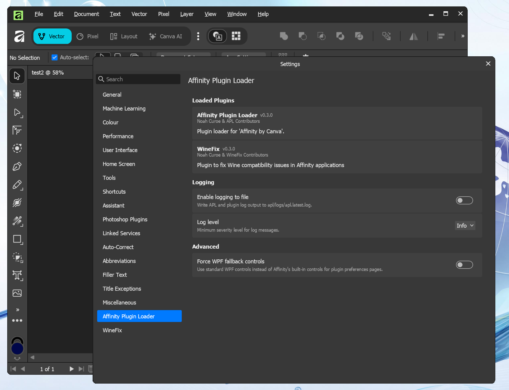

# Affinity Plugin Loader

A managed code plugin loader & injector hook for [Affinity](https://affinity.serif.com/) v3. Load custom code into Affinity and apply runtime patches using the [Harmony](https://github.com/pardeike/Harmony) library — no more patching DLL files on disk.

Supports Windows and Linux (Wine).

## Quick Links

- [Installation](guide/installation.md) — Install APL and run it for the first time
- [Configuration](guide/configuration.md) — APL settings and how to configure them
- [Creating a Plugin](dev/creating-a-plugin.md) — Developer guide for building APL plugins
- [Native Code APIs](dev/native-apis.md) — COM vtable hooking and native DLL patching
- [WineFix](winefix/index.md) — Plugin that fixes Wine-specific Affinity bugs
