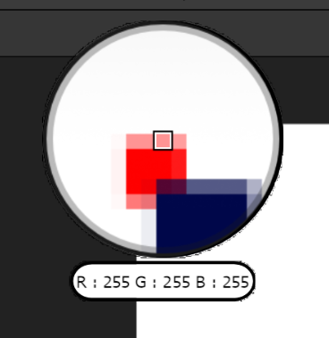
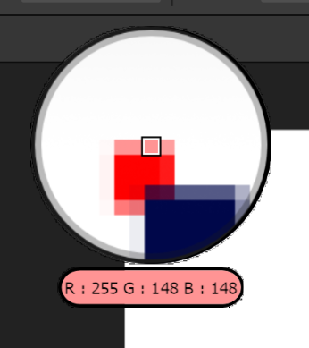

# WineFix

WineFix is an APL plugin that patches Wine-specific bugs in Affinity using runtime code patches. It applies [Harmony](https://github.com/pardeike/Harmony) IL transpilers for .NET-level fixes, and uses APL's [native code APIs](../dev/native-apis.md) (COM vtable hooking and in-memory patching) for native rendering fixes.

## Fixes

### Bezier rendering fix

Wine's Direct2D implementation approximates every cubic Bézier with a single quadratic, which produces visible distortion on curves with high curvature or inflection points. WineFix hooks the `ID2D1GeometrySink` COM vtable at runtime to intercept cubic Bézier calls (`AddBezier`, `AddBeziers`) and replaces them with adaptive cubic-to-quadratic subdivision using De Casteljau's algorithm. The resulting quadratic segments are emitted via `AddQuadraticBeziers`, which Wine renders correctly.

This approach works across all Wine versions (7.9 through 11.6+ tested) because COM vtable layout is defined by the interface ABI and never changes between implementations.

### Collinear outline join fix

When two adjacent outline segments are collinear, Wine's `d2d_geometry_outline_add_join` unconditionally places join vertices 25 units away from the join point. This is correct for hairpin reversals but produces visible spike artifacts on smooth curve continuations from Bézier subdivision. WineFix patches d2d1.dll in memory to zero this offset, making collinear joins flat.

The patch is applied by scanning d2d1.dll's `.text` section for the `movss xmm0, [25.0f]` instruction and replacing it with `xorps xmm0, xmm0` (0.0f). Based on a [Wine patch by Arecsu](https://github.com/Arecsu/wine-affinity).

### Preferences save fix

Preferences fail to save on application exit under Wine. A Harmony transpiler replaces the call to `HasPreviousPackageInstalled()` with `false`, which otherwise throws an exception that blocks the preferences save path.

### Color picker Wayland fix

The color picker zoom preview displays a black image on Wayland because `CopyFromScreen` returns black. WineFix replaces it with a `BitBlt` from the canvas window. Auto-detected by default; [configurable](configuration.md).

### Font enumeration fix

Intermittent startup crash from parallel font enumeration in `libkernel.dll`. Forces synchronous font loading. Enabled by default; [configurable](configuration.md).

### Canva sign-in bypass

!!! warning
    WineFix currently patches out the Canva sign-in dialog prompt. This is temporary and will be restored once there is a consistent fix for the sign-in browser redirect and Affinity protocol handler.

## Color Picker Sampling Modes

The color picker has two sampling modes, configurable in [settings](configuration.md):

- **Native** (default) — Uses Affinity's built-in color sampling pipeline. Colors are sampled in the document's native color space (sRGB, CMYK, wide-gamut, etc.). The highlighted pixel in the zoom preview may differ slightly from the actual sampled color value due to differences in how the zoom preview and the native picker resolve coordinates.
- **Exact** — Picks the literal pixel color shown in the zoom preview center. Samples from a screen capture in sRGB. The picked color always matches what you see in the zoom, but does not use the document's native color space.

Use Native for color-accurate work (especially CMYK or wide-gamut documents). Use Exact if you want the picked color to always match the zoom preview.

| Native | Exact |
|--------|-------|
|  |  |
| The highlighted pixel reads `R:255 G:255 B:255` — the sampled color differs from what's visible in the zoom preview. | The highlighted pixel reads `R:255 G:148 B:148` — the sampled color matches the actual pixel shown in the zoom preview. |

## Known Open Bugs

These are under investigation and not yet patched:

- Accepting crash reporting causes a permanent crash until preferences are cleared
- Embedded SVG document editor crashes after being open for some time

We are open to resolving any Wine-specific bugs. Feel free to [open an issue](https://github.com/noahc3/AffinityPluginLoader/issues) requesting a patch — just keep in mind these bugs take time to research and develop patches for, especially when native code is involved.

## Licensing

WineFix is licensed under **GPLv2**. See the [LICENSE](https://github.com/noahc3/AffinityPluginLoader/blob/main/WineFix/LICENSE) file for details.
